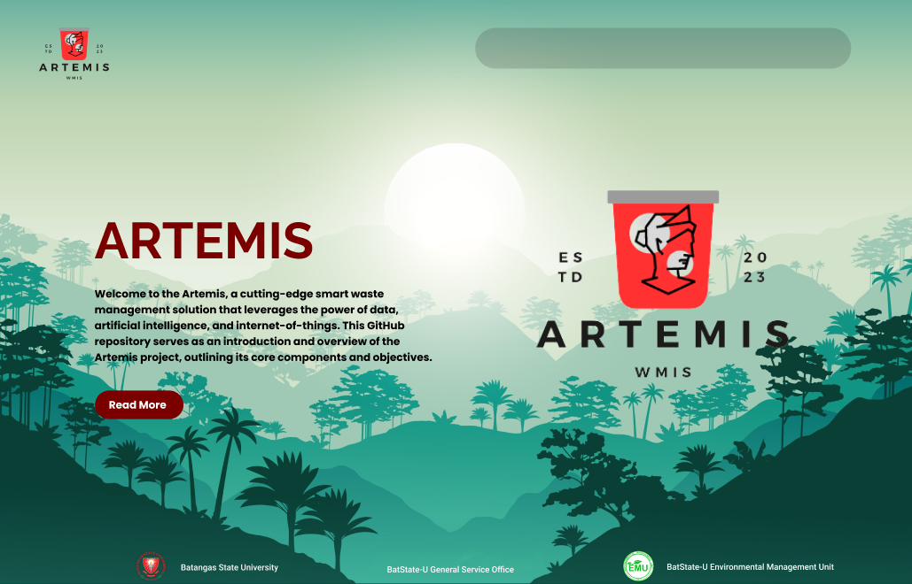
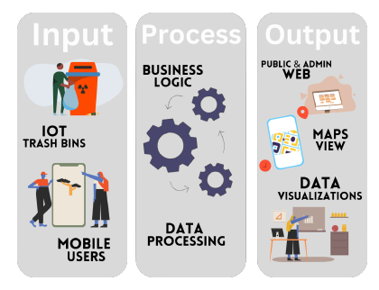
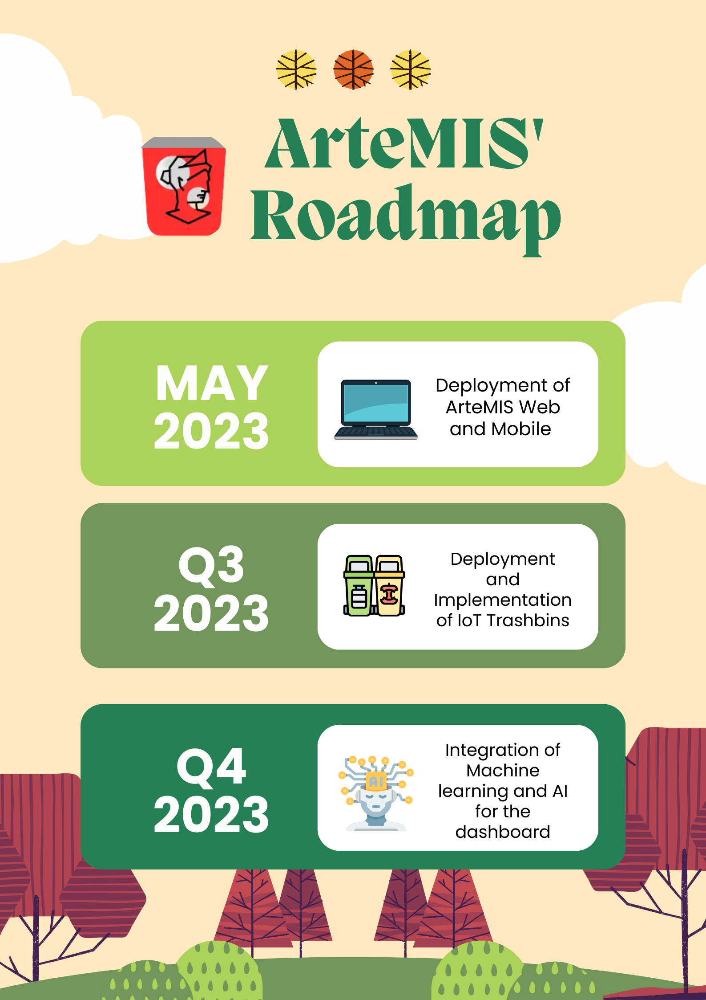

# [Artemis: A Smart Waste Management Solution](https://artemis-b18ae.web.app)
Welcome to the Artemis, a cutting-edge smart waste management solution that leverages the power of data, artificial intelligence, and internet-of-things. This GitHub repository serves as an introduction and overview of the Artemis project, outlining its core components and objectives.

Visit us by clicking the title of this section or through this [hyperlink](https://artemis-b18ae.web.app)

## Project Overview

The Artemis project is driven by a core mission: to redefine waste management by integrating innovative technologies. At its heart, Artemis is an ecosystem comprised of three key systems:

1. **Artemis Web Dashboard**: A user-friendly web interface designed for waste management professionals, allowing them to monitor, analyze, and optimize waste management processes seamlessly.

2. **Artemis Mobile**: A mobile application that empowers users, including individuals and businesses, to interact with Artemis, making informed decisions and contributing to efficient waste management.

3. **IoT Trashbins**: A network of smart trash bins equipped with Internet of Things (IoT) technology. These bins automatically collect and transmit data, ensuring that waste management professionals have real-time insights into waste levels and other essential metrics.

## The Waste Management Challenge

The Philippines, like many other regions, faces persistent waste management challenges despite governmental efforts. Artemis acknowledges that traditional approaches have been insufficient in significantly reducing pollution and waste generation rates. This project seeks to address this issue comprehensively.

## Our Approach

Artemis focuses on more than just regulatory compliance. It places a strong emphasis on enhancing the user experience, considering the needs of individual users, waste management professionals, and the environment. By seamlessly integrating data analytics, AI, and IoT technologies, Artemis creates a robust waste management system that automates data collection and analytics.

The goal is to enable users to focus on making informed decisions and developing effective waste management plans, rather than grappling with the intricacies of waste management processes.

Primary data source will be coming from the smart trash bin, which aims to collect various critical waste-related data. The data will then be processed through a pipeline which will feed the system with its need to generate a data inferences, analytics, and dataset for forecasting. The output made from having all those data is displayed in interactive data visualizations that aims to effectively deliver the needed information for the users' needs. 

### Data visiualization
The potential of visualizing data is limitless. It offers a lot of convenience rather than relying on old means of counting and excel-based visuals that for most is overwhelming. That is why most businesses other systems that contains overwhelming data seek to need data visualization. [Data visualization](https://hdsr.mitpress.mit.edu/pub/zok97i7p/release/4) offers analyzation of complex datam identifying patterns, and extracting valuable insights for faster and more efficient decision making. 

## The Roadmap

## Join Us

The Artemis project is more than just an application; it's a commitment to sustainability, innovation, and a better quality of life. By collaborating with us, you can contribute to a cleaner, greener future and help revolutionize waste management practices.

You can contact us through email - artemis.batstateu@gmail.com

